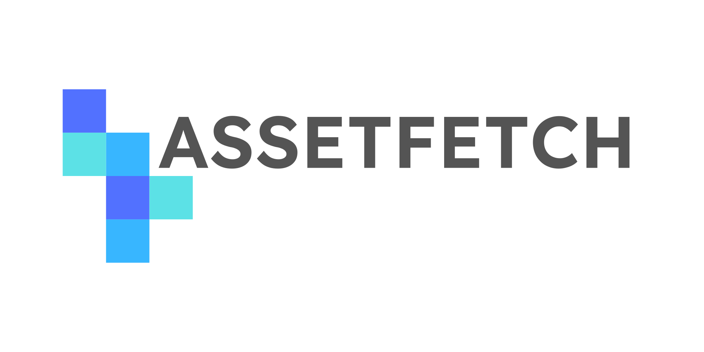

# AssetFetch: Integrated 3D Asset Discovery and Imports for Everybody

AssetFetch is an open system for browsing, retrieving and handling/importing digital assets for media creation with a focus on easy implementation.
The AssetFetch Protocol provides a simple way for artists to interact with publicly available 3D asset libraries without the need to leave their current software.

Such functionality was previously only achievable through vendor- and software-specific plugins like the [Poliigon 3DSMax Addon](https://www.poliigon.com/3ds-max), [Poly Haven Asset Browser](https://blendermarket.com/products/poly-haven-asset-browser) or [Quixel Bridge](https://quixel.com/plugins/).

AssetFetch aims to generalize the interaction with vendors by offering a simple HTTP- and JSON-based API specification which clients can use to receive files and metadata from asset vendors.
This way, **artists** can use a single AssetFetch-Plugin per application to browse the collection of all participating vendors.
**Vendors** can profit from only needing to implement one simple API instead of having to develop and maintain a set of highly-specialized plugins.

!!! note "Project Status"
	AssetFetch is currently in the early stages of development, meaning that the specification itself is still subject to changes and improvements.
	Version 0.1 was released in February 2024 with version 0.2 scheduled for release this summer.

	**Plugins:**
	A blender client plugin is in development and will be released later this summer.

	**Providers:**
	An AssetFetch endpoint will be added to [ambientCG.com](https://ambientCG.com) later this summer.

	**Spec Updates:**
	Read the [latest draft version](./latest-draft.md) and [check the open issues on GitHub](https://github.com/AssetFetch/spec/blob/main/spec.md) to see the latest changes and updates

	<a href="https://ambientcg.com/legal">Imprint</a>

